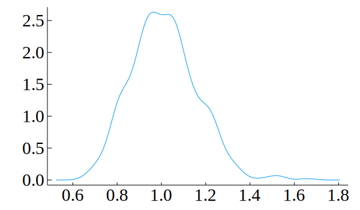
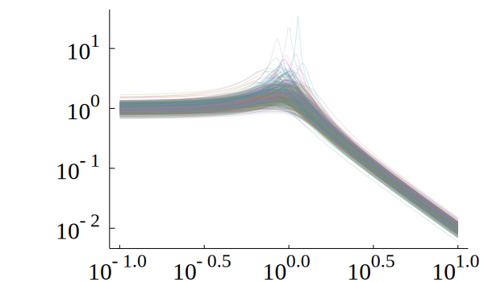
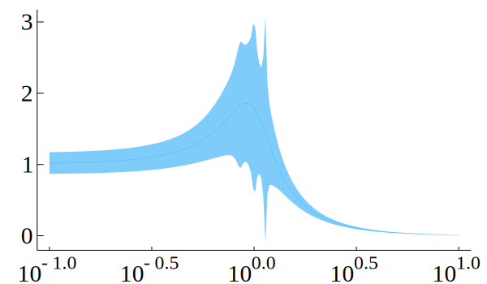

# MonteCarloMeasurements

[](https://travis-ci.org/baggepinnen/MonteCarloMeasurements.jl)
[](https://codecov.io/gh/baggepinnen/MonteCarloMeasurements.jl)

This package provides two types `Particles <: Real` and `StaticParticles <: Real` that represents a distribution of a floating point number, kind of like the type `Measurement` from [Measurements.jl](https://github.com/JuliaPhysics/Measurements.jl). The difference compared to a `Measurement` is that `Particles` represent the distribution using a vector of unweighted particles, and can thus represent arbitrary distributions and handles nonlinear uncertainty propagation well. Functions like `f(x) = x²` or `f(x) = sign(x)` at `x=0`, are not handled well using linear uncertainty propagation ala [Measurements.jl](https://github.com/JuliaPhysics/Measurements.jl). The goal is to have a number of this type behave just as any other number while partaking in calculations. After a calculation, the `mean`, `std` etc. can be extracted from the number using the corresponding functions. `Particles` also interact with Distributions.jl, so that you can call, e.g., `Normal(p)` and get back a `Normal` type from distributions or `fit(Gamma, p)` to get a `Gamma`distribution. Particles can also be iterated, asked for `maximum/minimum`, `quantile` etc. If particles are plotted with `plot(p)`, a histogram is displayed. This requires Plots.jl.

## Basic Examples
```julia
julia> p = StaticParticles(100)
100 StaticParticles: -0.006 ± 1.069

julia> cov(p)
1.142303346809804

julia> std(p)
1.0687859218804316

julia> var(p)
1.142303346809804

julia> mean(p)
-0.0063862728919496315

julia> f = x -> 2x + 10
#104 (generic function with 1 method)

julia> 9.6 < f(p) < 10.4 # Comparisons are using the mean
true

julia> f(p) ≈ 10 # ≈ determines if f(p) is within 2σ of 10
true

julia> f(p) ≲ 15 # ≲ (\lesssim) tests if f(p) is significantly less than 15
true

julia> Normal(f(p)) # Fits a normal distribution
Normal{Float64}(μ=9.9872274542161, σ=2.1375718437608633)

julia> fit(Normal, f(p)) # Same as above
Normal{Float64}(μ=9.9872274542161, σ=2.1268571304548938)
```

## Why
Convenience. Also, the benefit of using this number type instead of manually calling a function `f` with perturbed inputs is that, at least in theory, each intermediate operation on a `Particles` can exploit SIMD, since it's performed over a vector. If the function `f` is called several times, however, the compiler might not be smart enough to SIMD the entire thing. Further, any dynamic dispatch is only paid for once, whereas it would be paid for `N` times if doing things manually. One could perhaps also make an argument for cache locality being favorable for the `Particles` type, but I'm not sure this holds for all examples. A benchmark example (more further down)
```julia
using BenchmarkTools
A = [Particles(1000) for i = 1:3, j = 1:3]
B = similar(A, Float64)
@btime qr($A)
  119.243 μs (257 allocations: 456.58 KiB)
@btime foreach(_->qr($B), 1:1000)
  3.916 ms (4000 allocations: 500.00 KiB)
```
that's about a 30-fold reduction in time, and the repeated `qr` didn't even store or handle the statistics of the result.
The type `StaticParticles` contains a statically sized, stack-allocated vector from StaticArrays.jl. This type is suitable if the number of particles is small, say < 500 ish.
```julia
A = [StaticParticles(100) for i = 1:3, j = 1:3]
B = similar(A, Float64)
@btime qr($(copy(A)))
  8.392 μs (16 allocations: 18.94 KiB)
@btime map(_->qr($B), 1:100);
  690.590 μs (403 allocations: 50.92 KiB)
# Wow that's over 80 times faster
# Bigger matrix
A = [StaticParticles(100) for i = 1:30, j = 1:30]
B = similar(A, Float64)
@btime qr($(copy(A)))
  1.823 ms (99 allocations: 802.63 KiB)
@btime map(_->qr($B), 1:100);
  75.068 ms (403 allocations: 2.11 MiB)
# 40 times faster
```
`StaticParticles` allocate much less memory than regular `Partricles`, but are more stressful for the compiler to handle.

## Constructors
The most basic constructor of `Particles` acts more or less like `randn(N)`, i.e., it creates a particle cloud with distribution `Normal(0,1)`. To create a particle cloud with distribution `Normal(μ,σ)`, you can call `μ + σ*Particles(N)`, or `Particles(N, Normal(μ,σ))`. This last constructor works with any distribution from which one can sample.
One can also call (`Particles/StaticParticles`)
- `Particles(v::Vector)` pre-sampled particles
- `Particles(N = 500, d::Distribution = Normal(0,1))` samples `N` particles from the distribution `d`.
- We don't export the ± operator so as to not mess with [Measurements.jl](https://github.com/JuliaPhysics/Measurements.jl), but you can import it by `import MonteCarloMeasurements.±`. We then have `μ ± σ = μ + σ*Particles(500)`

**Common univariate distributions are sampled systematically**, meaning that a single random number is drawn and used to seed the sample. This will reduce the variance of the sample. The systematic sample can maintain its originally sorted order by calling `Particles(N, permute=false)`, but the default is to permute the sample so as to not have different `Particles` correlate strongly with each other.


## Multivariate particles
The constructors can be called with multivariate distributions, returning `v::Vector{Particle}` where particles are sampled from the desired multivariate distribution. Once `v` is propagated through a function `v2 = f(v)`, the results can be analyzed by asking for `mean(v2)` and `cov(v2)`, or by fitting a multivariate distribution, e.g., `MvNormal(v2)`.

A `v::Vector{Particle}` can be converted into a `Matrix` by calling `Matrix(v)` and this will have a size of `N × dim`.

## Plotting
An instance of `p::Particle` can be plotted using `plot(p)`, that creates a histogram by default. If `StatsPlots.jl` is available, once can call `density(p)` to get a slightly different visualization. Vectors of particles can be plotted using one of
- `errorbarplot`
- `mcplot`
- `ribbonplot`

Below is an example using [ControlSystems.jl](https://github.com/JuliaControl/ControlSystems.jl)
```julia
using ControlSystems, MonteCarloMeasurements, StatsPlots
import MonteCarloMeasurements: ±

p = 1 ± 0.1
ζ = 0.3 ± 0.1
ω = 1 ± 0.1
G = tf([p*ω], [1, 2ζ*ω, ω^2])

dc = dcgain(G)[]
# 500 Particles: 1.012 ± 0.149
density(dc)
```

```julia
w = exp10.(LinRange(-1,1,200))
mag, phase = bode(G,w) .|> vec

errorbarplot(w,mag, yscale=:log10, xscale=:log10)
```

```julia
mcplot(w,mag, yscale=:log10, xscale=:log10, alpha=0.2)
```

```julia
ribbonplot(w,mag, yscale=:identity, xscale=:log10, alpha=0.2)
```


### Control systems benchmark
```julia
using BenchmarkTools, Printf
p  = 1 ± 0.1
ζ  = 0.3 ± 0.1
ω  = 1 ± 0.1
G  = tf([p*ω], [1, 2ζ*ω, ω^2])
t1 = @belapsed bode($G,$w)
p  = 1
ζ  = 0.3
ω  = 1
G  = tf([p*ω], [1, 2ζ*ω, ω^2])
t2 = @belapsed bode($G,$w)

@printf("Time with 500 particles: %16.4fms \nTime with regular floating point: %7.4fms\n500×floating point time: %16.4fms\nSpeedup factor: %22.1fx\n", 1000*t1, 1000*t2, 1000*500t2, 500t2/t1)
  # Time with 500 particles:          14.9095ms
  # Time with regular floating point:  0.5517ms
  # 500×floating point time:         275.8640ms
  # Speedup factor:                   18.5x
```
